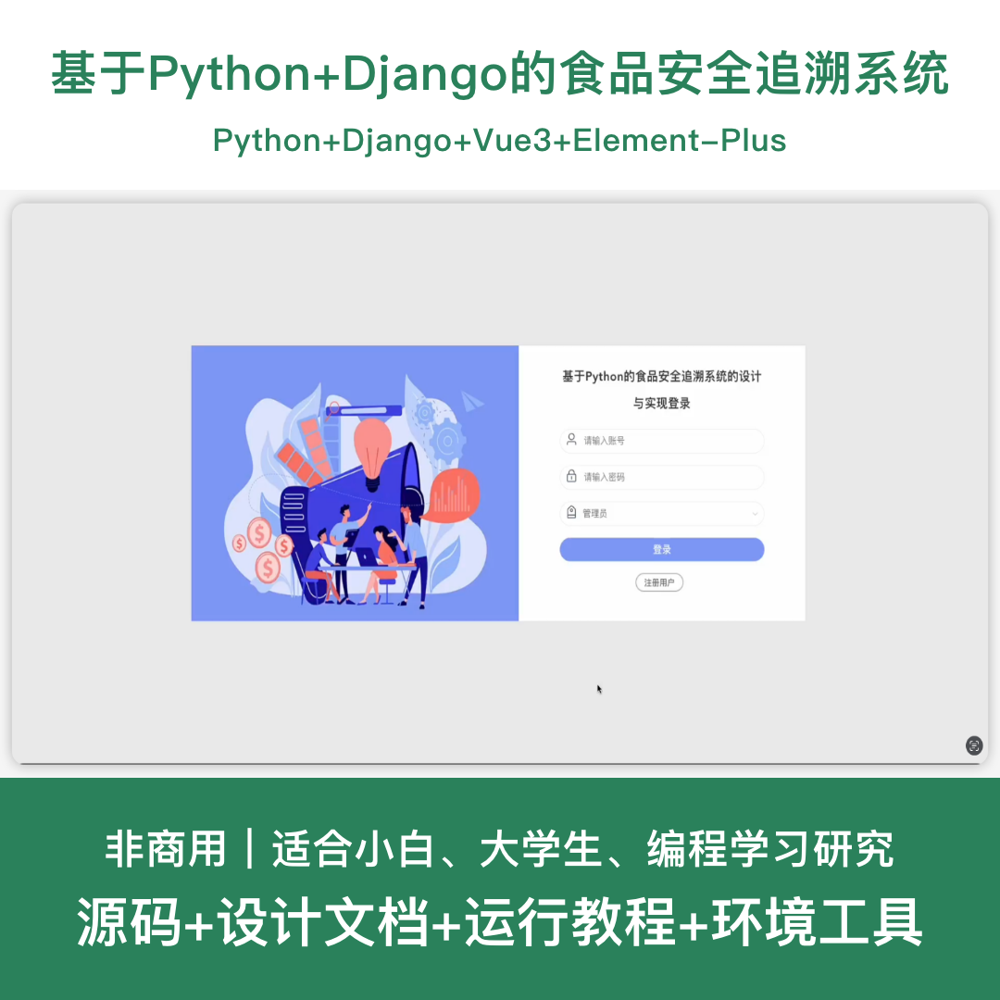
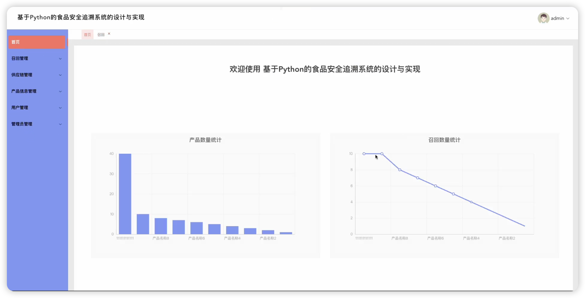
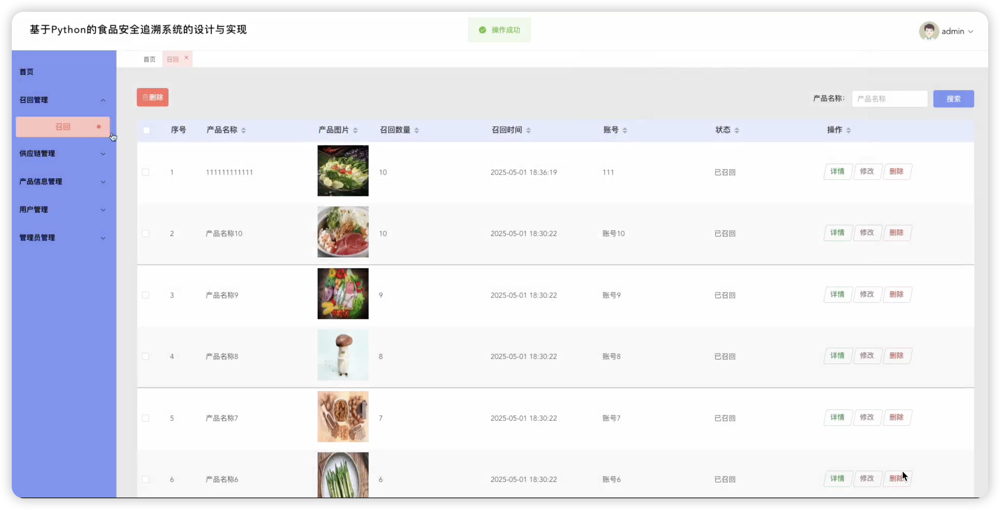
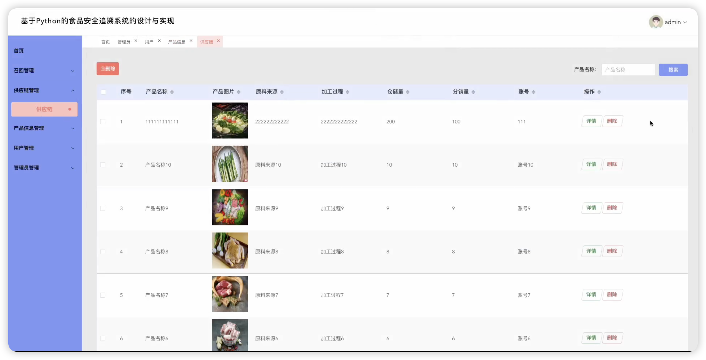
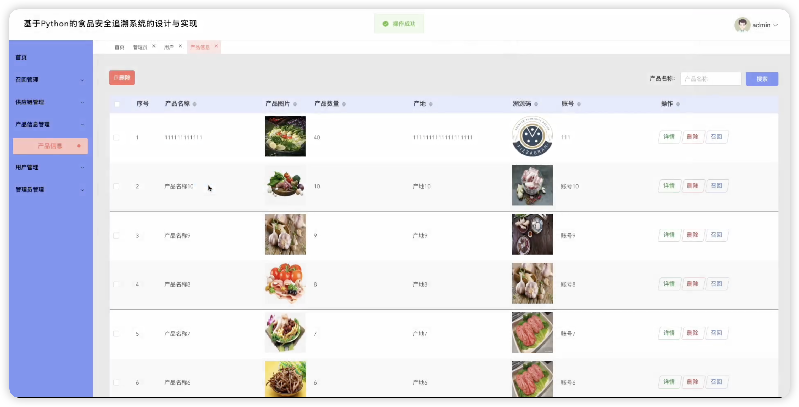
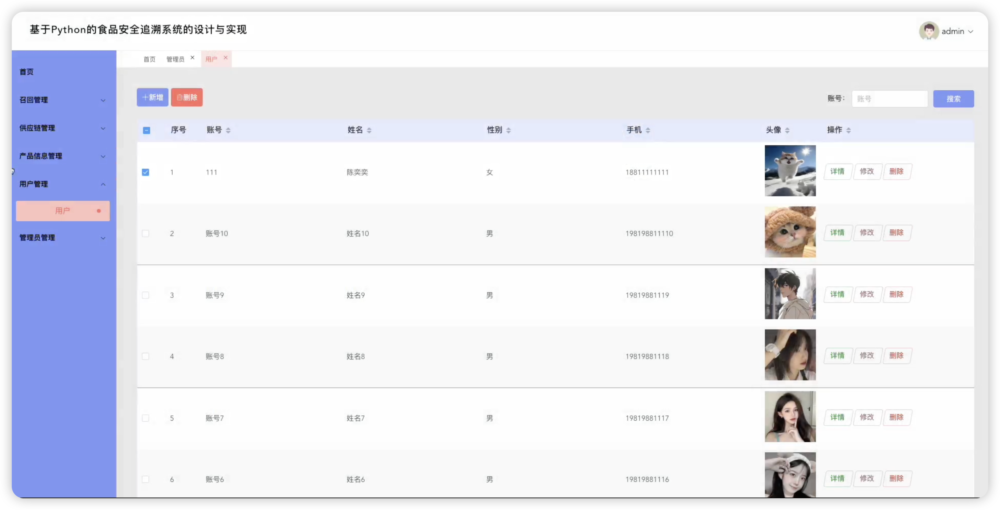
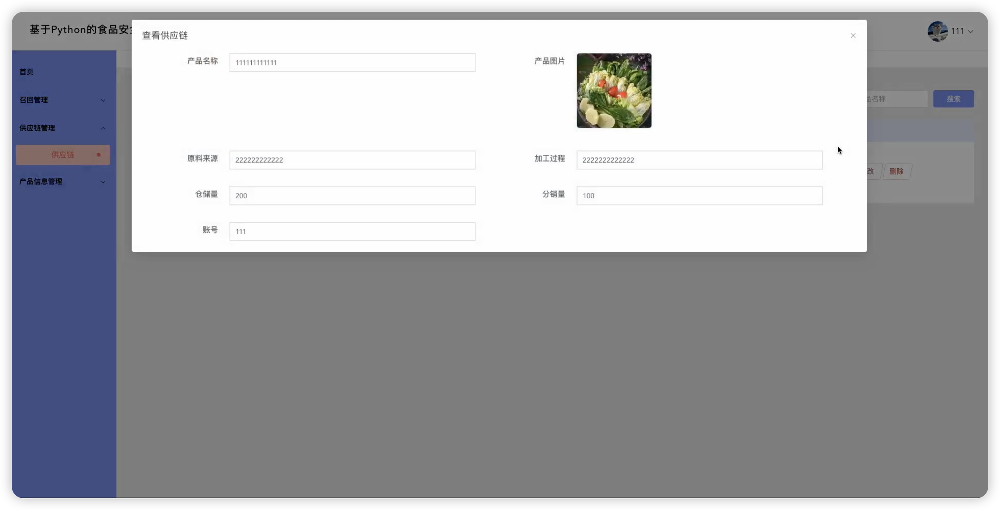
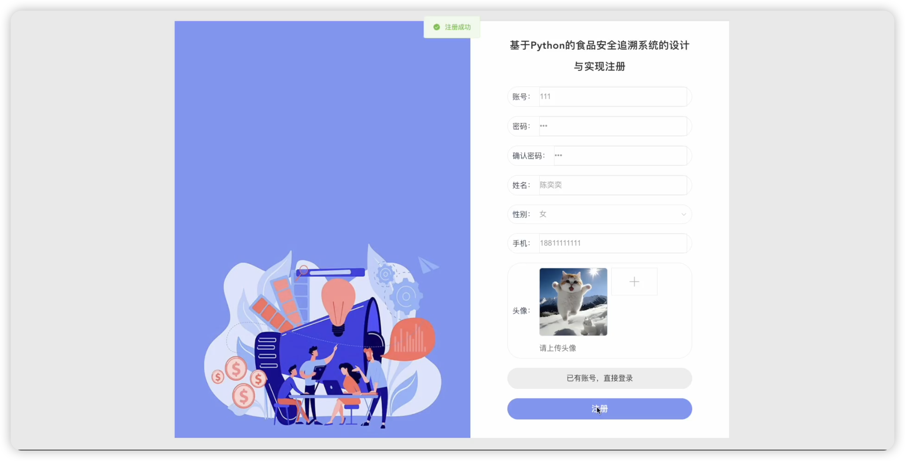

# python112D
python112D基于Python+Django的食品安全追溯系统+LW
 
## 源码问题查看主页咨询

### 一、关键词
食品安全系统、食品追溯系统、食品溯源系统、食品质量管理系统、食品监管系统

### 二、作品包含
源码+数据库+设计文档+全套环境和工具资源+本地部署教程

### 三、项目技术
前端技术： Html、Css、Js、Vue3.2、Element-Plus
后端技术：Python、Django、PyMySQL

### 四、运行环境（以下版本亲测，其他版本兼容性请自行测试）
开发工具：PyCharm + VSCODE

数据库：MySQL 5.7+

数据库管理工具：Navicat10以上版本

环境配置软件： Python 3.x

前端Nodejs：16+

浏览器：谷歌浏览器

### 五、项目介绍
项目编号：python112D

基于Python+Django的食品安全追溯系统，提供从生产到销售的全流程追溯，包括产品信息管理、供应链追踪、质量监管和产品召回等功能，确保食品质量安全可追溯。

角色：管理员、用户

管理员功能：产品信息管理、供应链管理、召回管理、配置管理、系统设置。

用户功能：首页、召回管理、供应链管理、产品信息管理

数据库共6张表。

### 六、运行截图

